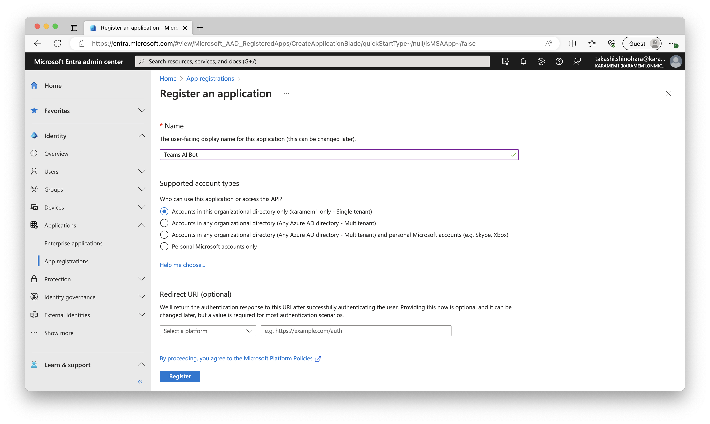

# はじめての ChatGPT で Teams ボット ハンズオン

## 事前準備

**重要: 以下の事前準備を満たさない場合はハンズオンを実施できません。必ず確認をお願いします。**

- Microsoft 365 開発者プログラムで作成したテナント
    - Microsoft 365 開発者プログラムに参加し開発者向けサブスクリプションを有効にしたテナントを作成してください。  
      https://developer.microsoft.com/en-us/microsoft-365/dev-program/
- Microsoft Azure サブスクリプション
    - お持ちでない場合は無料試用版を利用できます。これにより $200 のクレジットが 30 日間無料で使用できます。無料試用版の開始にはクレジット カードが必要です。  
      https://azure.microsoft.com/ja-jp/pricing/offers/ms-azr-0044p/
    - Microsoft 365 開発者プログラムのテナントと同じである必要はありません。
- OpenAI アカウント
    - OpenAI にサインインてください。OpenAI API は有料ですが一定期間は無料枠が使用できます。  
      https://openai.com/

## 開発環境

- Windows または MacOS
- Visual Studio Code
  - C# 拡張機能
  - Azure App Service 拡張機能
- .NET Core SDK 6.0 (**重要: .NET Core SDK 7.0 がインストールされている環境では動作しません。**)
- Bot Framework Emulator

## ハンズオン

### .NET Core のバージョンの確認

この手順では、.NET Core SDK 6.0 がインストールされているかどうかを確認します。

1. インストールされている .NET Core SDK のバーションを表示します。

    ```
    dotnet --list-sdks
    ```

1. 表示された最新のバージョンを確認してください。
    - `6.0.*` の場合は以降の手順は必要ありません。
    - `7.0.*` の場合は、.NET Core のバージョンを指定するために、作業ディレクトリ (任意) に `global.json` ファイルを作成します。`{{sdk-version}}` の値は上記で表示された .NET Core 6.0 のバージョンを指定してください。

        ```json
        {
          "sdk": {
            "version": "{{sdk-version}}"
          }
        }
        ```

    - 上記以外の場合は .NET Core SDK 6.0 をインストールしてください。

### プロジェクトを作成する

この手順では、Bot Framework の EchoBot テンプレートを使用して、プロジェクトを作成するところまでを実施します。上記の手順で `global.json` を作成している場合は、ファイルのあるディレクトリで実施してください。

1. Bot Framework テンプレートをインストールします。

    ```
    dotnet new -i Microsoft.Bot.Framework.CSharp.EchoBot
    ```

1. プロジェクトを作成します。

    ```
    dotnet new echobot -n TeamsAIBot
    ```

1. `TeamsAIBot` を Visual Studio Code で開きます。

    ```
    cd TeamsAIBot
    code .
    ```

1. `tasks.json` を作成します。メニューの **ターミナル** - **タスクの構成** - **テンプレートから tasks.json を生成** - **.NET Core** をクリックします。
1. `launch.json` を作成します。メニューの **実行** - **構成の追加** - **.NET 5+ and .NET Core** をクリックします。
1. プロジェクトをビルドします。メニューの **ターミナル** - **ビルド タスクの実行** をクリックします。

### コードを修正する

この手順では、作成したプロジェクトに対して、Open AI と会話するためのコードを追加します。

1. OpenAI クライアント ライブラリのパッケージを追加します。

    ```
    dotnet add package Azure.AI.OpenAI --prerelease
    ```

1. Visual Code で `Startup.cs` を開き、以下を修正します。
    - `ConfigureService` メソッドに以下のコードを追加します。

        ```csharp
        services.AddSingleton<IStorage>(new MemoryStorage());
        services.AddSingleton<ConversationState>();
        ```

1. Visual Code で `Bots/EchoBot.cs` を開き、以下を修正します。
    - `using` のセクションに OpenAI クライアント ライブラリの宣言を追加します。

        ```csharp
        using Microsoft.Extensions.Configuration;
        using Azure.AI.OpenAI;
        ```

    - コンストラクタとして以下のコードを追加します。`{{api-key}}` の部分を OpenAI から取得した API キーに変更します。

        ```csharp
        private readonly OpenAIClient chatClient;
        private readonly ConversationState conversationState;

        public EchoBot(IConfiguration configuration, ConversationState conversationState)
        {
            this.chatClient = new OpenAIClient("{{api-key}}");
            this.conversationState = conversationState;
        }
        ```

    - `OnMessageActivityAsync` メソッドを以下のコードで置き換えます。

        ```csharp
        protected override async Task OnMessageActivityAsync(ITurnContext<IMessageActivity> turnContext, CancellationToken cancellationToken)
        {
            var accessor = this.conversationState.CreateProperty<List<ChatMessage>>(nameof(ChatMessage));
            var messages = await accessor.GetAsync(turnContext, () => new(), cancellationToken);
            while (messages.Count > 8)
            {
                messages.RemoveAt(0);
            }
            var chatCompletionsOptions = new ChatCompletionsOptions();
            chatCompletionsOptions.Messages.Add(new ChatMessage(
                ChatRole.System,
                "あなたは Microsoft Bot Framework から呼び出されるアシスタントです。ユーザーからの質問に回答してください。"
            ));
            foreach (var message in messages)
            {
                chatCompletionsOptions.Messages.Add(message);
            }
            chatCompletionsOptions.Messages.Add(new ChatMessage(ChatRole.User, turnContext.Activity.Text));
            var chatCompletion = await this.chatClient.GetChatCompletionsAsync(
                "gpt-3.5-turbo",
                chatCompletionsOptions,
                cancellationToken
            );
            var replyText = chatCompletion.Value.Choices[0].Message.Content;
            await turnContext.SendActivityAsync(MessageFactory.Text(replyText, replyText), cancellationToken);
            messages.Add(new ChatMessage(ChatRole.User, turnContext.Activity.Text));
            messages.Add(new ChatMessage(ChatRole.Assistant, replyText));
            await accessor.SetAsync(turnContext, messages, cancellationToken);
            await this.conversationState.SaveChangesAsync(turnContext, cancellationToken: cancellationToken);
        }
        ```

1. デバッグを開始します。**実行** - **デバッグの開始** をクリックします。以下のような画面が表示されることを確認します。


1. Bot Framework Emulator から作成したボットに接続します。Bot Framework Emulator を起動し、**Open Bot** をクリックします。必要な項目を入力し **Connect** をクリックします。

    |項目名|項目値|
    |-|-|
    |Bot URL|`http://localhost:3978/api/messages`|


1. チャット欄に質問を入力し回答が得られることを確認します。


### Azure AD アプリケーションを作成する

この手順では、Azure Bot Service を動作させるための Azure AD アプリケーションを作成します。

1. [Microsoft Entra 管理センター](https://entra.microsoft.com) にアクセスし **Microsoft 365 開発者プログラムで作成したテナント** のアカウントでサインインします。
1. メニューの **ID** - **アプリケーション** - **アプリの登録** をクリックします。
1. **新規登録** をクリックします。
1. 必要な項目を入力し **登録** をクリックします。

    |項目名|項目値|
    |-|-|
    |名前|ChatGPT Teams Bot|
    |サポートされているアカウントの種類|この組織ディレクトリのみに含まれるアカウント (シングル テナント)|



1. **概要** の **テナント ID** および **クライアント ID** の値をメモします。


1. **証明書とシークレット** - **新しいクライアント シークレット** をクリックします。

1. **追加** をクリックします。
1. 作成された **クライアント シークレット** をメモします。


1. メモした **テナント ID**、**クライアント ID**、**クライアント シークレット** を `appsettings.json` に貼り付けます。

    |項目名|項目値|
    |-|-|
    |MicrosoftAppType|`MicrosoftAppType`|
    |MicrosoftAppId|**クライアント ID**|
    |MicrosoftAppPassword|**クライアント シークレット**|
    |MicrosoftAppTenantId|**テナント ID**|

### Azure Web Apps を作成する

### Azure Bot Service を作成する

### Teams アプリをデプロイする
